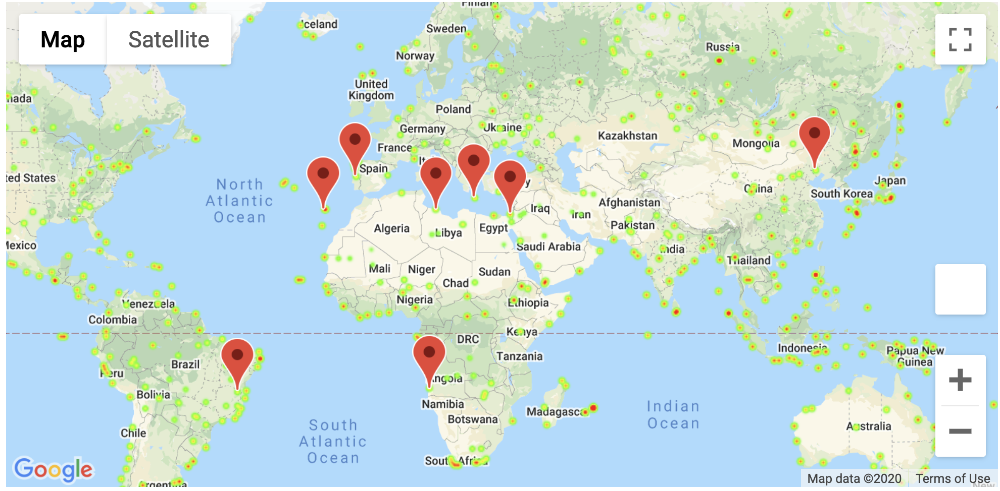

# Python_Api_Challenge

# Data Source 
 `http://api.openweathermap.org/data/2.5/forecast?id=524901&APPID=`
 `https://maps.googleapis.com/maps/api/place/textsearch/json?location=`

# Weather
Using the weather API, I looped through the cities and pulled the following data to create a dataframe:
* cityname
* lat
* lng
* max_temp 
* humidity 
* cloudiness 
* wind_speed
* country
* date
* count 

## Analysis

### City Latitude vs. Max Temperature

### City Latitude vs. Humidity

### City Latitude vs. Cloudiness

### City Latitude vs. Wind Speed

### Northern Hemisphere Latitude vs. Max Temperature

### Southern Hemisphere Latitude vs. Max Temperature

### Northern Hemisphere Latitude vs. Humidity

### Southern Hemisphere Latitude vs. Humidity

### Northern Hemisphere Latitude vs. Cloudiness

### Southern Hemisphere Latitude vs. Cloudiness

### Northern Hemisphere Latitude vs. Wind Speed

### Southern Hemisphere Latitude vs. Wind Speed

# Vacation
Using the city_data.csv file, I created a new dataframe to narrow down the cities by ideal weather conditions.
For ideal weather conditions, max temperature had to be less than 80 but higher than 70, wind speed less than 10mph, and no cloudiness. 
Next, I created a hotel dataframe and used the google api to pull in the closet hotel using the latitude and longitude of the cities in our dataframe with the ideal weather conditions. A heatmap was then used to show the locations of the hotals that have the ideal weather conditions we were looking for. 

## Output

